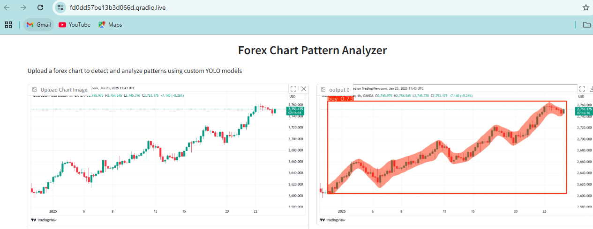
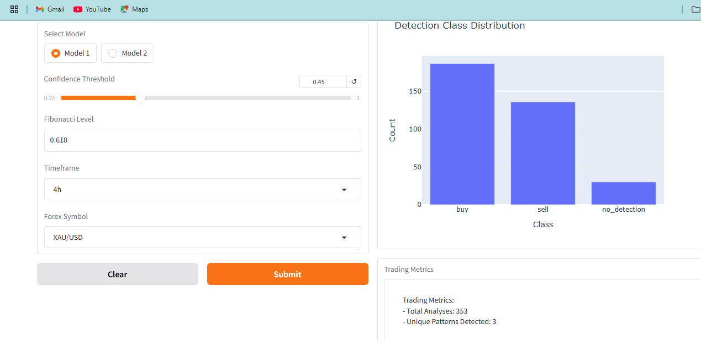

# Forex Chart Pattern Analyzer

## Project Overview
This project demonstrates a robust instance segmentation model designed for detecting and analyzing patterns on Forex trading charts. The models, built using YOLOv8 Segmentation (`yolov8n-seg` and `yolov8l-seg`), were fine-tuned on custom-annotated datasets created with the Roboflow platform. The application is deployed on Hugging Face using the Gradio framework, allowing users to upload charts and gain insights into potential trading patterns.

## Features
- **Instance Segmentation:** Detects key patterns and highlights them on forex chart images.
- **Interactive User Interface:** Utilizes Gradio for a seamless and intuitive experience.
- **Trading Insights:** Provides a breakdown of detected classes, visualizations, and basic trading metrics.
- **Multiple Models Support:** Users can select between two YOLO models (`Model 1` and `Model 2`).

## App Deployment
Explore the live app on Hugging Face:
[Forex Chart Pattern Analyzer on Hugging Face](<https://huggingface.co/spaces/lamakye7/fxanalytics>)

### App Screenshot

## How It Works
1. **Upload Chart:** Select and upload a forex chart.
2. **Select Model:** Choose between Model 1 and Model 2 for prediction.
3. **Set Parameters:** Adjust confidence thresholds and select trading pairs.
4. **View Results:** Visualize the detected chart patterns and metrics.

## Key Visualizations
- **Annotated Charts:** Display patterns detected by the segmentation models.
- **Class Distributions:** Bar charts of the detection counts.
- **Trading Metrics:** Analysis insights for forex trading patterns.

## Future Improvements
- Enhanced trading metrics.
- Expanded dataset for more forex chart patterns.
- Integration with real-time trading data.

## Author
This project was developed by Louis Amakye, a Data Scientist passionate about AI-driven trading insights.

---
For questions, issues, or contributions, please create an issue on the GitHub repository.

